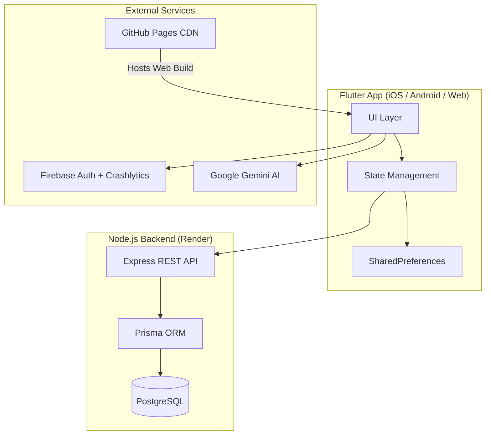

<div align="center">
  
  <h1>Parentpeak</h1>
  <p><strong>Nicht perfekt sein müssen. Einfach da sein.</strong></p>
  <p>Die App für Eltern die alles geben — und selbst Halt brauchen.</p>

  [](https://github.com/arambucak/Parentpeak/actions/workflows/flutter-analyze.yml)
  [](https://github.com/arambucak/Parentpeak/actions/workflows/deploy-web-pages.yml)
  
  
  
  
  

  <br>

  [Website](https://parentpeak.com) · [Web-App](https://parentpeak.de) · [Instagram](https://instagram.com/parentpeak.app)
</div>

---

## Was ist Parentpeak?

Eine Familien-App die Eltern dort unterstützt wo es zählt — im Alltag. Kein Feature-Dschungel, sondern durchdachte Werkzeuge für Kalender, Ernährung, Erziehungsfragen, Community und Organisation. Pädagogisch fundiert, KI-gestützt, privacy-first.

## Screenshots

<div align="center">
  
  
  
  
</div>

## Features

| Feature | Beschreibung |
|---------|-------------|
| 📅 **Familienkalender** | Termine, Feiertage, Schulferien (DE/AT/CH/TR/GB) |
| 🤖 **KI-Elternberatung** | 8 pädagogische Ansätze (GfK, Hüther, Montessori, Reggio, Freinet, Fröbel, Situationsansatz, Juul) |
| 🎉 **Events & Aktivitäten** | Lokale Familien-Events, KI-gesteuert, standortbasiert |
| 🎁 **Verschenkmarkt** | Kindersachen verschenken statt wegwerfen — lokal & solidarisch |
| 🍳 **Familien-Küche** | Altersgerechte Rezepte per 1-Tap, mit Einkaufsliste |
| 👫 **Eltern-Netzwerk** | Spielfreunde finden, Kontakte knüpfen |
| 💰 **Familien-Geld** | Leistungs-Wegweiser für 6 Länder |
| 📋 **Familien-Zentrale** | Einkaufsliste, To-do, Kind-Dossier |
| 🌱 **Impulse & Entwicklung** | Tagesimpuls, Entwicklungs-Check (220+ Fragen), Experten-Bibliothek |
| 🌍 **28 Sprachen** | DE, EN, TR, KU und mehr |

## Architektur



## Tech Stack

| Layer | Technologie |
|-------|------------|
| Frontend | Flutter 3.44 (Dart) — iOS, Android, macOS, Web |
| Backend | Node.js / Express / Prisma / PostgreSQL |
| AI | Google Gemini (integrativer pädagogischer Ansatz) |
| Auth | Firebase Authentication (Email + Google Sign-In) |
| Monitoring | Firebase Crashlytics |
| CI/CD | GitHub Actions (Analyze, Deploy, Keep-Alive, AI-Check) |
| Hosting | Render (Backend), GitHub Pages (Web) |

## Quick Start

```bash
# 1. Dependencies installieren
flutter pub get

# 2. Environment konfigurieren
cp .env.example .env
# → GEMINI_API_KEY und BACKEND_BASE_URL eintragen

# 3. Starten
flutter run -d chrome          # Web
flutter run -d <simulator-id>  # iOS Simulator
flutter run                    # Connected Device
```

## Environment Variables

| Variable | Beschreibung | Pflicht |
|----------|-------------|---------|
| `GEMINI_API_KEY` | Google Gemini API Key | ✅ |
| `GEMINI_MODEL_NAME` | Gemini Model (default: gemini-3.5-flash-lite) | ❌ |
| `BACKEND_BASE_URL` | Render Backend URL | ✅ |
| `BACKEND_API_TOKEN` | API Authentication Token | ✅ |

## CI/CD Pipeline

| Workflow | Trigger | Aufgabe |
|----------|---------|---------|
| `flutter-analyze.yml` | Push, PR, Daily 02:00 | Dart Analyze, Tests, iOS/macOS Smoke Build |
| `deploy-web-pages.yml` | Push to main | Flutter Web Build → GitHub Pages |
| `backend-keepalive.yml` | Every 14 min | Health-Ping an Render (Free Tier) |
| `pedagogical-ai-daily-check.yml` | Daily | KI-Qualitätsprüfung |

## Deployment

- **Web:** Automatisch via GitHub Actions → GitHub Pages (`parentpeak.de`)
- **Backend:** Render Auto-Deploy from `main`
- **iOS/Android:** Manual Release (geplant: Fastlane)

## Projekt-Struktur

```
lib/
├── main.dart                  # App Entry + Firebase Init
├── screens/                   # Alle Feature-Screens
├── services/                  # API, Gemini, Notifications
├── widgets/                   # Reusable Components
├── models/                    # Data Models
└── utils/                     # Helpers, Constants

backend/
├── server.js                  # Express Server
├── prisma/                    # Schema + Migrations
└── routes/                    # API Endpoints

.github/workflows/             # CI/CD Pipelines
artifacts/emulator-demo/       # App Screenshots
```

## Links

| | |
|---|---|
| 🌐 Website | [parentpeak.com](https://parentpeak.com) |
| 📱 Web-App | [parentpeak.de](https://parentpeak.de) |
| 📸 Instagram | [@parentpeak.app](https://instagram.com/parentpeak.app) |
| 📧 Support | [support@parentpeak.com](mailto:support@parentpeak.com) |

## License

All rights reserved. © 2026 Fatih Bucak — Parentpeak.

Unauthorized copying, modification, or distribution of this software is prohibited.
